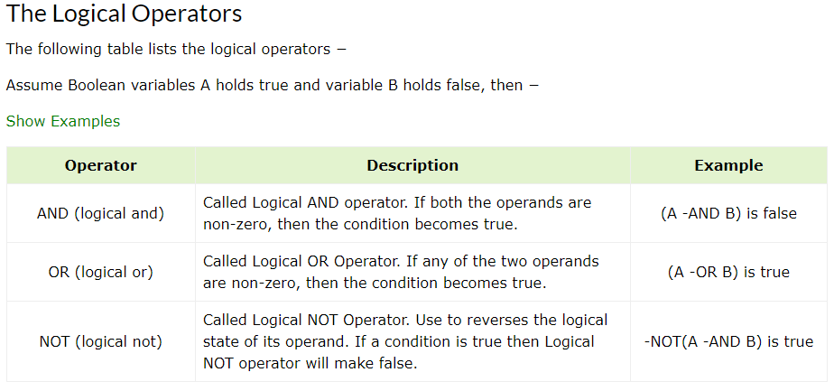

# Powershell
## Variables
### Creating a variable
```PS
$location = Get-Location
```

### Using a variable
```PS
 $location
```

### Getting information of variable
```PS
  $location | Get-Member
```

## Comparison operators


## Logical operators


## Loops
### For
```PS
$array = @("item1", "item2", "item3")
for($i = 0; $i -lt $array.length; $i++){ $array[$i] }
```

### Foreach
```PS
$array = @("item1", "item2", "item3")
foreach ($element in $array) { $element }
$array | foreach { $_ }
```

### While Loop
```PS
$array = @("item1", "item2", "item3")
$counter = 0;

while($counter -lt $array.length){
   $array[$counter]
   $counter += 1
}
```

### Do-While Loop
```PS
$array = @("item1", "item2", "item3")
$counter = 0;

do {
   $array[$counter]
   $counter += 1
} while($counter -lt $array.length)
}
```

## Conditions
## if statement
```PS
$x = 10
if($x -le 20){
   write-host("This is if statement")
}
```

## if else statement
```PS
$x = 30
if($x -eq 10){
   write-host("Value of X is 10")
} elseif($x -eq 20){
   write-host("Value of X is 20")
} elseif($x -eq 30){
   write-host("Value of X is 30")
} else {
   write-host("This is else statement")
}
```

## nested if statement
```PS
$x = 30
$y = 10
if($x -eq 30){
   if($y -eq 10) {
      write-host("X = 30 and Y = 10")
   }
}   
```

## switch statement
```PS
switch(4,2){
   1 {"One"}
   2 {"Two"}
   3 {"Three"; break }
   4 {"Four"}
   3 {"Three Again"}
}
```
# Brackets


## Special Variables
| Operator  | Description |
|-----------|-------------|
| $$        |	Represents the last token in the last line received by the session.
| $?        |	Represents the execution status of the last operation. It contains TRUE if the last operation succeeded and FALSE if it failed.
| $^        |	Represents the first token in the last line received by the session.
| $_        |	Same as $PSItem. Contains the current object in the pipeline object. You can use this variable in commands that perform an action on every object or on selected objects in a pipeline.
| $ARGS                 |	Represents an array of the undeclared parameters and/or parameter values that are passed to a function, script, or script block.
| $CONSOLEFILENAME      |	Represents the path of the console file (.psc1) that was most recently used in the session.
| $ERROR                |	Represents an array of error objects that represent the most recent errors.
| $EVENT                |	Represents a PSEventArgs object that represents the event that is being processed.
| $EVENTARGS            |	Represents an object that represents the first event argument that derives from EventArgs of the event that is being processed.
| $EVENTSUBSCRIBER      |	Represents a PSEventSubscriber object that represents the event subscriber of the event that is being processed.
| $EXECUTIONCONTEXT     |	Represents an EngineIntrinsics object that represents the execution context of the PowerShell host.
| $FALSE                |	Represents FALSE. You can use this variable to represent FALSE in commands and scripts instead of using the string "false".
| $FOREACH              |	Represents the enumerator (not the resulting values) of a ForEach loop. You can use the properties and methods of enumerators on the value of the $ForEach variable.
| $HOME                 |	Represents the full path of the user's home directory.
| $HOST                 |	Represents an object that represents the current host application for PowerShell.
| $INPUT                |	Represents an enumerator that enumerates all input that is passed to a function.
| $LASTEXITCODE         |	Represents the exit code of the last Windows-based program that was run.
| $MATCHES              |	The $Matches variable works with the -match and -notmatch operators.
| $MYINVOCATION         |	$MyInvocation is populated only for scripts, function, and script blocks. PSScriptRoot and PSCommandPath properties of the $MyInvocation automatic variable contain information about the invoker or calling script, not the current script.
| $NESTEDPROMPTLEVEL    |	Represents the current prompt level.
| $NULL                 |	$null is an automatic variable that contains a NULL or empty value. You can use this variable to represent an absent or undefined value in commands and scripts.
| $PID                  |	Represents the process identifier (PID) of the process that is hosting the current PowerShell session.
| $PROFILE              |	Represents the full path of the PowerShell profile for the current user and the current host application.
| $PSCMDLET             |	Represents an object that represents the cmdlet or advanced function that is being run.
| $PSCOMMANDPATH        |	Represents the full path and file name of the script that is being run.
| $PSCULTURE            |	Represents the name of the culture currently in use in the operating system.
| $PSDEBUGCONTEXT       |	While debugging, this variable contains information about the debugging environment. Otherwise, it contains a NULL value.
| $PSHOME               |	Represents the full path of the installation directory for PowerShell.
| $PSITEM               |	Same as $_. Contains the current object in the pipeline object.
| $PSSCRIPTROOT         |	Represents the directory from which a script is being run.
| $PSSENDERINFO         |	Represents information about the user who started the PSSession, including the user identity and the time zone of the originating computer.
| $PSUICULTURE          |	Represents the name of the user interface (UI) culture that is currently in use in the operating system.
| $PSVERSIONTABLE       |	Represents a read-only hash table that displays details about the version of PowerShell that is running in the current session.
| $SENDER               |	Represents the object that generated this event.
| $SHELLID              |	Represents the identifier of the current shell.
| $STACKTRACE           |	Represents a stack trace for the most recent error.
| $THIS                 |	In a script block that defines a script property or script method, the $This variable refers to the object that is being extended.
| $TRUE                 |	Represents TRUE. You can use this variable to represent TRUE in commands and scripts.